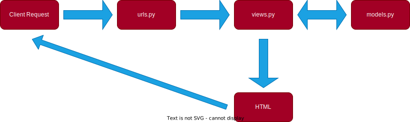

** Assignment 2 **

• First, I'm making an empty git repository inside my chosen directory, then I create a new repository on github. After I connect the local repository to the remote repository on github, I create a python virtual environment. After I activate the virtual environment, then I install the dependencies required by the software to function. Then, I can create a django project. In the django project file, there exist a file named 'settings.py' to setting the project and I set the value of 'ALLOWED_HOST' inside the file to ['*'] so it can be accessed by any host, which will make the application accessible widely. Then I add a .gitignore file to the repository that is used to specify files and directories that should be ignored by git. 

After that, I create a django application. I make sure to register the django application to the django project by adding the name of the django application in the variable 'INSTALLED_APPS' on the 'settings.py' file. Then I create a model on the django application with three attributes, name as the name of the item with type CharField, amount as the amount/count of the item with type IntegerField, and description as the description of the item with type TextField. The model is used to providing a structured and organized way to work with the data. Then I create a function in 'views.py' named 'show_main'. The function includes a list of datas and a dictionary so it can be called in my html template. After that, I create an html template to create the structure and appearance of my data content on web pages. In the template, I call the data retrieved from the dictionary to the template. Then I create a routing in urls in the django application to configure the URL related to the application and urls in the django project to configure the top-level project URL. After that I create a basic testing to check the accessibility of the urls and if the page is rendered by using the html template or not. After I successfully run the tests, I can deploy the application

• 

The URL that is requested by the client must be matched to the urls in 'urls.py', then 'views.py' take the client request. 'views.py' may interact with 'models.py' to retrieve data. After that, 'views.py' renders the HTML template then return that as an output or response to the request

• The virtual environment is used to isolate packages and dependencies of a python project, preventing conflicts with other versions on the computer.

We can create a django web app without a virtual environment but it might create a dependencies conflicts if different projects require different versions of django or other packages.

• MVC (Model-View-Controller) is an architectural concept that separates the key components of an application into the model, the view, and the controller. MVT (Model-View-Template) is is an architectural concept used in web development to separate the key components of an application into the model, the view, and the template. MVVM (Model-View-ViewModel) is an architectural pattern that separates an application into three main logical components: the model, the view, and the view model

Differences between the three are ways to bridge between the model that represents the data and the view that represents the user interface. MVC use controller which receives user input from the view, processes it using the model, and updates the view accordingly. MVT use template which defines the structure and presentation of the user interface. It separates the HTML markup from Python code. MVVM use view model which exposes data and commands that the view can bind to. This separation of concerns can make the UI more testable and maintainable.

** Assignment 3 **

• Post method sends new data to an application programming interface to be processed or stored. Get method retrieves data from an application programming interface.

• HTML is used for creating web pages and web content. The browser requests an HTML page and the server will returns an HTML file. XMl is a markup language that uses tags to represent data in a hierarchical and structured manner. It is often used for configuration files, data interchange between heterogeneous systems, and defining document structures. JSON is a lightweight data interchange format that represents data as key-value pairs or arrays. It is widely used for data exchange between web services and APIs, configuration files, and storing structured data in databases. For XML and JSON, the browser requests data then the server returns data (in XML or JSON).

• Because JSON is highly readable and often preferred for configuration files and APIs due to its simplicity and compactness. JSON's structure is also simpler compared to XML, which makes it more concise for data transmission.

• First, I change one of the path in urlpatterns list in urls.py inside my django project folder named 'main/' to ''. Then, I create a folder in the root directory named templates and create an HTML file inside it named 'base.html'. The HTML will function as base template that can be used as a general structure for the website's page. Then I adjust the base directory in settings.py as 'templates'. Then, I change my 'main.html' as an extension of 'base.html'. Then I create a forms.py file in my django app folder to create a form structure that accepts new item data. After that, I add a function in views.py to to automatically add a new product when the form is submitted. I also change the show main function to make an object that can fetch all item object from my application database. Then, I create a 'create_product.html' inside the same folder as 'main.html' and also modified the 'main.html' file so it can add a 'add new product' button.

Then I modify my views.py and urls.py inside the django app folder so I can return data as XML and JSON. I create a function to fetch and return data as XML and JSON. Then I add the new urls path in urls.py inside the django app folder. I also modify it to retrieve data based on ID in XML and JSON. I did the same thing as I did to XML and JSON but I create a variable in the function to store the query result of data with a specific ID.

• Screenshot HTML

Screenshot XML

Screenshot JSON

Screenshot XML by ID

Screenshot JSON by ID

I use the internet to get references and chatgpt to help me with syntax error and server error